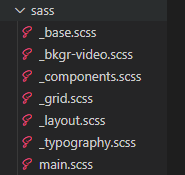
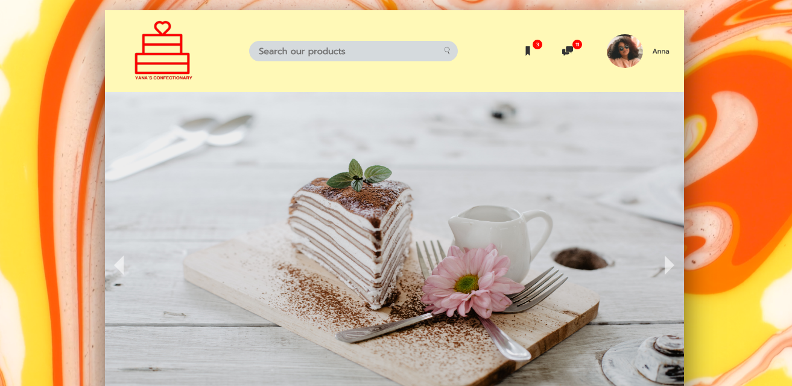
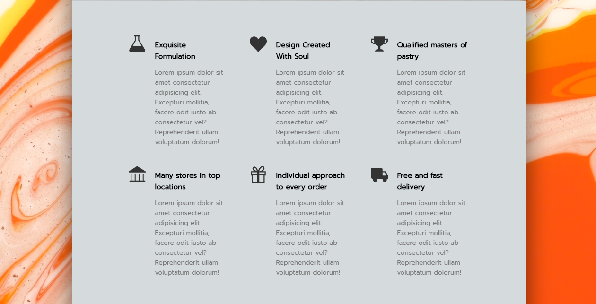
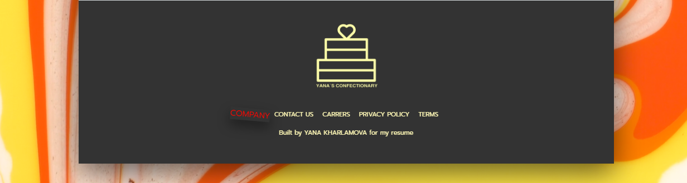

# Confectionary
## About
This is my original confectionary-website design.

It was inspired by lots of sweets and chocolates, that i can`t imagine my life without.

I tried to create a visually appealing site for my imaginary candy shop, that will present this business in a good light for potential customers.

Live version: https://yanakharlamova.github.io/Confectionary/;
## Features

My website contains:
* animated detailsin the header section;
* a background video-loop;
* image slider, that present different product items;
* separated area-blocks with different useful information;
* interactive footer, with additional data and contacts.
## Built with:
* HTML
* CSS
* Sass
* BEM
## Application Sass Structure

## Installing
Use this command in your terminal to run the project:
`npm run compile:sass`
## Screenshots
**1.**

**2.**
  

**3.**
 

